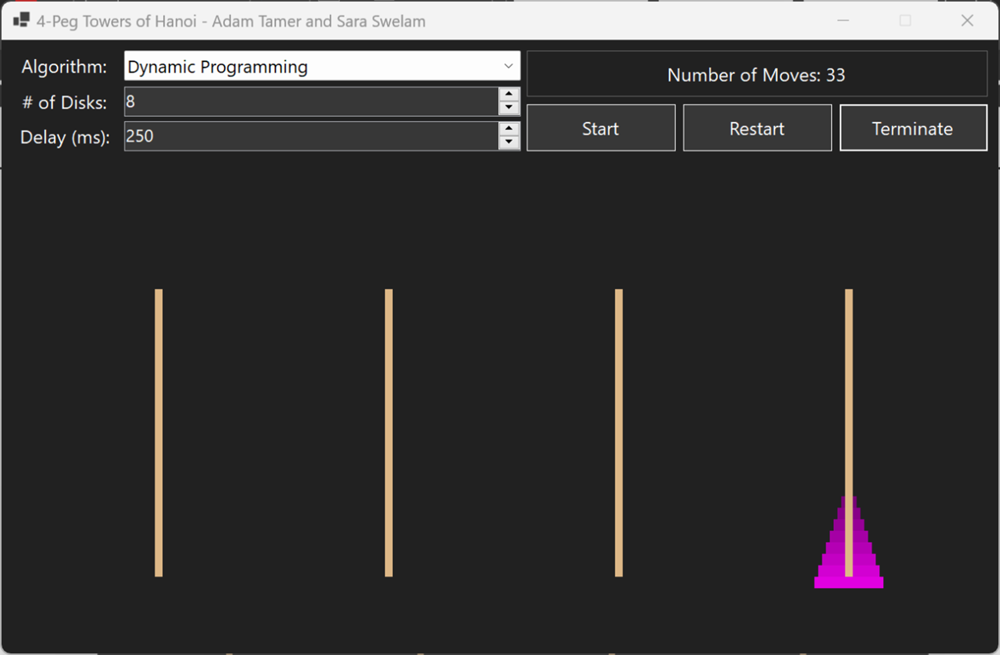

# 4-Peg Tower of Hanoi

## Description
There are eight disks of different sizes and four pegs. Initially, all the disks are on the first peg in order of size, the largest on the bottom and the smallest on the top.
Use divide and conquer method to transfer all the disks to another peg by a sequence of moves. Only one disk can be moved at a time, and it is forbidden to place a larger disk on top of a smaller one.
Does the Dynamic Programing algorithm can solve the puzzle in 33 moves? If not then design an algorithm that solves the puzzle in 33 moves.
Then design a Dynamic Programing algorithm to solve any number of disks of different sizes and four pegs puzzle.

## Detailed Assumptions
-	All disks start on peg 0, ordered from largest (bottom) to smallest (top).
-	Only one disk can be moved at a time, and a larger disk cannot be placed on a smaller one.
-	The goal is to move all disks to another peg using the minimum number of moves.
-	The optimal solution requires 33 moves for 8 disks using four pegs (based on Frame–Stewart algorithm).
-	A divide-and-conquer approach should be used to achieve this move count.
-	A dynamic programming version must generalize the solution to handle any number of disks efficiently.
-	All solutions must follow Tower of Hanoi rules and operate within the defined constraints.

## Program Showcase
- Test Case: (# of Disks = 8) — Dynamic Programming:
  
  

## Algorithms

### 1. Divide-and-Conquer (Frame–Stewart Algorithm)
#### Approach
- **Splits the problem** into smaller subproblems using an intermediate peg configuration.
- **Mathematically determines** the optimal split point `m` for minimal moves:
  - `m = n - floor(√(2n + 1)) + 1` (for 8 disks, `m = 4`).

#### Steps
1. **Move `m` disks** from the **source peg** to an **auxiliary peg** (using all 4 pegs).
2. **Move the remaining `n - m` disks** to the **destination peg** (using 3 pegs, since one peg is occupied by the `m` disks).
3. **Move the `m` disks** from the auxiliary peg to the **destination peg** (using all 4 pegs).

#### Complexity
- **Time**: O(2ⁿ) (exponential, but optimal for 4 pegs).
- **Space**: O(n) (recursion stack).

---

### 2. Dynamic Programming
#### Approach
- **Memoizes** the minimum moves required for subproblems (`CountMoves4Peg()`).
- **Iterates over possible splits** (`m`) to find the optimal configuration.

#### Steps
1. **Base Cases**: 
   - `n = 0` → 0 moves.
   - `n = 1` → 1 move.
2. **For each possible `m`** (from `1` to `n-1`):
   - Compute moves as `2 * CountMoves4Peg(m) + CountMoves3Peg(n - m)`.
   - Track the **minimum moves** and store results in a dictionary.

#### Complexity
- **Time**: O(n²) (due to memoization).
- **Space**: O(n) (for memoization table).

---

### 3. Brute-Force BFS
#### Approach
- **Explores all possible states** using BFS to guarantee the shortest path.
- **Tracks visited states** to avoid cycles.

#### Steps
1. **Initialize** the starting state (all disks on peg 0).
2. **For each state**:
   - Generate all valid moves (disk transfers between pegs).
   - Enqueue new states and track move sequences.
3. **Terminate** when the target state is reached.

#### Complexity
- **Time**: O(4ⁿ) (exponential, impractical for large `n`).
- **Space**: O(4ⁿ) (stores all visited states).

---

## Key Insights
1. **Divide-and-Conquer** is optimal for 4 pegs and leverages mathematical insight (`m = n - √(2n + 1) + 1`).
2. **Dynamic Programming** generalizes the solution efficiently using memoization.
3. **Brute-Force BFS** is only feasible for small `n` but guarantees correctness.

For 8 disks, the **divide-and-conquer method achieves 33 moves**, matching the theoretical minimum. The **DP solution** extends this to arbitrary `n` while avoiding recomputation.
